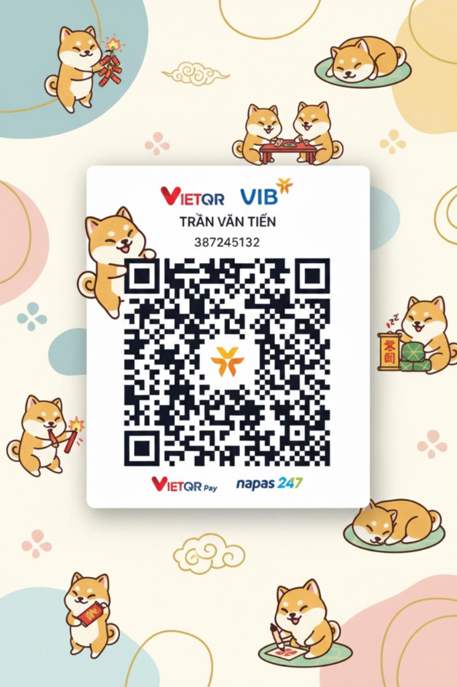

# 🛡️ Ni-Oh: Trợ Lý Chiến Lược Toàn Năng (Autonomous Strategic Companion)

[](https://github.com/Neito112/Neito-Agent)
[](LICENSE)
[]()
[]()
[]()

> **Ni-Oh** là một **Trợ Lý Chiến Lược Đa Năng** được phát triển bởi **Neito112**, đồng hành cùng bạn 24/7 trong cả **Công Việc, Học Tập, Nghiên Cứu, Xử Lý Dữ Liệu và Tác Chiến Game**.
> 
> Khác với các chatbot AI thụ động thông thường chỉ biết trò chuyện, Ni-Oh sở hữu:
> - ⚡ **Mắt nhìn cục bộ 0-Token**: Quét màn hình thời gian thực độ phân giải gốc 1080p/2K bằng Windows Native OCR và VLM Moondream.
> - 🧠 **Bộ não bồi đắp tri thức 24/7**: Chạy ngầm liên tục cập nhật meta, tài liệu vào kho kiến thức vĩnh viễn không tốn token cloud.
> - 📊 **Động cơ Bảng Tính 0-Token (Formula-Driven Engine)**: Tự động sinh công thức Google Sheets / Excel (`SUMIFS`, `XLOOKUP`, `ARRAYFORMULA`) để giải quyết các bài toán lớn mà không đốt token suy luận.
> - 🚀 **Khởi động 1-Click (`start.bat`)**: Tự động hóa 100% môi trường, chạy được ngay cả trên **máy tính mới tinh vừa cài lại Windows**.

---

## 🚀 Hướng Dẫn Cài Đặt 1-Click (Dành Cho Máy Mới Cài Win)

Ngay cả khi máy tính của bạn vừa mới cài lại Windows 10 hoặc Windows 11, **chưa cài đặt bất kỳ phần mềm lập trình nào** (chưa có Node.js, chưa có Git, chưa có Python), bạn chỉ cần làm đúng 2 bước:

### Bước 1: Tải mã nguồn về máy
* Bấm vào nút màu xanh **`Code`** ở đầu trang GitHub này ➔ Chọn **`Download ZIP`**.
* Hoặc tải nhanh bằng Git (nếu máy bạn đã có Git):
  ```cmd
  git clone https://github.com/Neito112/Neito-Agent.git
  ```
* Giải nén file ZIP vừa tải vào một thư mục bất kỳ trên máy (Ví dụ: `D:\Neito-Agent` hoặc ngoài Desktop).

### Bước 2: Nhấp đúp chuột vào file `start.bat`
* Vào thư mục vừa giải nén, nhấp đúp vào file **`start.bat`**.
* Hệ thống sẽ tự động làm toàn bộ mọi việc từ A đến Z!

---

## ⚙️ Cơ Chế Tự Động Hóa Của `start.bat`

Khi bạn nhấp vào `start.bat`, script sẽ tự động thực hiện các tác vụ sau mà bạn không cần gõ bất kỳ câu lệnh nào:

1. **Tự động tải Node.js LTS Portable**:
   - Nếu máy bạn chưa có Node.js, `start.bat` sẽ tự động dùng công cụ có sẵn của Windows để tải bản **Node.js v20 LTS Portable chính thức từ nodejs.org** (~29MB).
   - Tự giải nén vào thư mục độc lập `.runtime\`.
   - **Ưu điểm**: Không cần quyền Administrator, không cài đè lên hệ thống, không tạo rác Registry, xóa project là sạch máy 100%.
2. **Tự động cài đặt thư viện (`npm install`)**:
   - Tự động tải và thiết lập toàn bộ các thư viện cần thiết (`discord.js`, `exceljs`, `docx`, `pptxgenjs`, `pdf-lib`, `node-edge-tts`...).
3. **Tự động kiểm tra phần cứng & GPU**:
   - Nhận diện card đồ họa trên máy (Intel / AMD / NVIDIA).
   - Kiểm tra xem driver CUDA của NVIDIA đã sẵn sàng cho AI tăng tốc hay chưa.
4. **Tự động hỗ trợ tải Local AI Engine (Ollama)**:
   - Nếu bạn muốn chạy AI hoàn toàn Offline không tốn 1 đồng tiền token nào, `start.bat` có sẵn tùy chọn 1-click tải bộ cài Ollama chính thức.
5. **Kích hoạt chế độ Trò Chuyện Trực Tiếp (Interactive CLI)**:
   - Ngay cả khi bạn chưa cấu hình Discord Bot, `start.bat` vẫn không bao giờ bị văng hay tắt đột ngột. Nó sẽ tự bật khung chat ngay trên cửa sổ đen (Terminal) để bạn trò chuyện và nhờ Ni-Oh giải toán/làm việc ngay lập tức!

---

## ⚠️ Những Thứ `start.bat` Không Thể Tự Cài (Cần Người Dùng Cung Cấp)

Có những thông tin mang tính **bảo mật và riêng tư cá nhân** mà hệ thống không thể tự tạo thay cho bạn. Dưới đây là những thứ bạn cần chuẩn bị (Hệ thống sẽ tự động thông báo và hướng dẫn ngay trên màn hình khi cần):

### 1. Token Discord Bot (Để đưa Ni-Oh vào Discord của bạn)
* **Vì sao không thể tự cài**: Discord Bot Token là tài khoản bảo mật của riêng bạn, chỉ bạn mới có quyền tạo và quản lý.
* **Cách lấy miễn phí trong 1 phút**:
  1. Truy cập trang nhà phát triển Discord: [https://discord.com/developers/applications](https://discord.com/developers/applications)
  2. Bấm nút **`New Application`** ở góc trên bên phải ➔ Đặt tên cho bot (Ví dụ: `Ni-Oh`).
  3. Chọn menu **`Bot`** ở cột bên trái ➔ Bấm **`Reset Token`** (hoặc `Copy Token`) để lấy Token.
  4. Kéo xuống phần **`Privileged Gateway Intents`**, bật xanh cả 3 mục:
     - ✅ **`PRESENCE INTENT`**
     - ✅ **`SERVER MEMBERS INTENT`**
     - ✅ **`MESSAGE CONTENT INTENT`**
  5. Mở file `.env` (hoặc `tokens.json`) và dán token vào dòng:
     ```env
     DISCORD_TOKEN=dán_token_của_bạn_vào_đây
     ```
  6. Vào mục **`OAuth2`** ➔ **`URL Generator`** ➔ Tích chọn `bot` và `Administrator` ➔ Copy đường link hiện ra dán vào trình duyệt để mời Bot vào Discord Server của bạn.

---

### 2. Google Gemini API Key (Nếu dùng chế độ Cloud AI - Hoàn toàn MIỄN PHÍ)
* **Vì sao không thể tự cài**: Cần liên kết với tài khoản Google của bạn để nhận hạn mức miễn phí.
* **Cách lấy miễn phí trong 30 giây**:
  1. Truy cập Google AI Studio: [https://aistudio.google.com](https://aistudio.google.com)
  2. Đăng nhập tài khoản Google ➔ Bấm **`Get API Key`** ➔ Bấm **`Create API Key`**.
  3. Dán key vào file `.env`:
     ```env
     GEMINI_API_KEY=dán_gemini_key_vào_đây
     ```

---

### 3. Driver Card Đồ Họa NVIDIA (Nếu máy bạn có Card rời)
* **Tình huống**: Trên máy tính mới cài lại Windows, Windows Update thường chỉ cài driver hiển thị cơ bản, thiếu bộ thư viện tính toán CUDA của NVIDIA.
* **Khắc phục**:
  - Truy cập trang chủ NVIDIA: [https://www.nvidia.com/download/index.aspx](https://www.nvidia.com/download/index.aspx)
  - Chọn đúng dòng Card của bạn (GeForce RTX/GTX) và tải bản **Game Ready Driver** hoặc **Studio Driver** mới nhất về cài đặt.
  - Sau khi cài, card của bạn sẽ chạy AI nhanh gấp 15 - 20 lần so với CPU.

---

### 4. Bấm "Allow access" khi Windows Firewall hỏi quyền mạng
* **Tình huống**: Lần đầu chạy trên Windows mới, hệ thống sẽ mở kết nối mạng ra ngoài để kết nối Discord và lắng nghe Webhook. Windows Defender Firewall có thể hiện một bảng thông báo: *"Windows Defender Firewall has blocked some features of this app"*.
* **Khắc phục**: Tích chọn vào cả 2 ô **Private networks** và **Public networks**, sau đó bấm **`Allow access`** (Cho phép truy cập).

---

## 🌟 Các Tính Năng Đột Phá Của Ni-Oh

### 1. 📊 Động Cơ Tính Toán Bảng Tính 0-Token (`computation_sheet_engine.js`)
* Thay vì để AI suy luận nhẩm số học rất dễ bị sai số và cực kỳ tốn token, Ni-Oh tự động dịch bài toán kinh doanh, tài chính, bảng lương của bạn thành **Công thức chuẩn của Google Sheets / Excel** (`SUMIFS`, `XLOOKUP`, `INDEX/MATCH`, `ARRAYFORMULA`).
* Sau đó xuất ra file `.xlsx` hoặc hướng dẫn bạn nạp vào Google Sheet để máy tính tự động tính toán ra kết quả trong 1 mili-giây với **độ chính xác 100% và tiết kiệm 99.9% token**.

### 2. 🎮 Trợ Lý Tác Chiến Màn Hình Trực Tiếp (`strategic_live_companion.js`)
* Bật / Tắt phiên hỗ trợ trực tiếp bằng lệnh: `!live start` và `!live stop`.
* Quét màn hình máy tính ở **độ phân giải gốc 1080p/2K** bằng Windows Native OCR kết hợp mô hình thị giác cục bộ Moondream (0 token cloud).
* **Cơ chế hỏi xác nhận chủ động**: Khi phát hiện bạn bước vào một vùng đất mới hoặc gặp câu đố mới, Ni-Oh sẽ lịch sự hỏi bạn có cần hỗ trợ không. Nếu bạn bảo không cần, Ni-Oh lập tức giữ im lặng và không ghi log chi tiết để tránh làm phiền bạn.

### 3. 🧠 Bộ Não Tri Thức Chạy Ngầm 24/7 (`knowledge_daemon.js`)
* Chừng nào máy tính còn mở, một tiến trình siêu nhẹ sử dụng Model Local (Ollama Qwen/Gemma) sẽ quét cập nhật các thay đổi, bản cập nhật mới, tài liệu nghiên cứu và bồi đắp vào kho nhớ vĩnh viễn `protocols/`.

### 4. 📁 Đọc & Tạo Đa Dạng Thể Loại Tệp
* **Tạo file**: Bảng tính Excel có sẵn công thức, Tài liệu Word (`.docx`), Slide thuyết trình PowerPoint (`.pptx`), Tệp PDF chuẩn tiếng Việt có dấu, File ghi âm giọng nói tiếng Việt tự nhiên (`.mp3`).
* **Đọc file chuyên biệt**: Bóc tách hình ảnh xem trước và cấu trúc của các tệp đồ họa và thiết kế kỹ thuật: CorelDRAW (`.cdr`), SketchUp (`.skp`), 3ds Max (`.max`), AutoCAD (`.dwg`, `.dxf`), Photoshop (`.psd`), Illustrator (`.ai`).

### 5. 🎙️ Hệ Thống Voice Agent Nguồn Mở Đa Dạng (Tùy Chọn Giọng Đọc Đỉnh Cao)
Ni-Oh được tích hợp sẵn các nguồn Voice AI mã nguồn mở chất lượng cao nhất hiện nay, hoạt động mượt mà và hoàn toàn không tốn token:
* **Microsoft Edge Neural TTS (Tích hợp sẵn - 0 Cấu hình - 100% Miễn phí)**:
  - 🇻🇳 `vi-VN-HoaiMyNeural` (Nữ Việt: Ấm áp, tự nhiên, truyền cảm)
  - 🇻🇳 `vi-VN-NamMinhNeural` (Nam Việt: Chuẩn giọng miền Bắc, dứt khoát, chuyên nghiệp)
  - 🇺🇸 `en-US-JennyNeural`, `en-US-GuyNeural` (Tiếng Anh Mỹ tự nhiên)
  - 🇯🇵 `ja-JP-NanamiNeural` (Tiếng Nhật phong cách Anime)
* **Liên kết các nguồn mở Voice SOTA hàng đầu thế giới**:
  - [**Kokoro-82M**](https://github.com/hexgrad/kokoro): Mô hình Neural TTS mã nguồn mở nhẹ nhất (82M params) đạt chất lượng âm thanh sánh ngang các dịch vụ thương mại hàng đầu thế giới.
  - [**Piper TTS**](https://github.com/rhasspy/piper): Hệ thống phát âm thanh thần kinh siêu tốc, chạy 100% offline trên CPU/GPU, hỗ trợ model tiếng Việt Vivos.
  - [**ChatTTS**](https://github.com/2noise/ChatTTS): Mô hình âm thanh đàm thoại chuyên biệt cho AI Agent, tự động mô phỏng tiếng thở, ngắt nghỉ và tiếng cười tự nhiên.
  - [**F5-TTS**](https://github.com/SWivid/F5-TTS): Mô hình nhân bản giọng nói (Zero-Shot Voice Cloning) nhanh và chân thực chỉ từ vài giây audio mẫu.

👉 **Cách chọn giọng cực nhanh**:
- Trên Discord: Gõ `!voice list` để xem toàn bộ giọng có sẵn, hoặc gõ `!voice set hoaimy` (Nữ) / `!voice set namminh` (Nam).
- Trong file `.env`: Thay đổi giá trị `VOICE_NAME=vi-VN-HoaiMyNeural`.

---

## 🕹️ Bảng Lệnh Nhanh Trên Discord & Terminal

| Lệnh | Ý nghĩa & Hành động |
| :--- | :--- |
| `!live start` | Khởi động phiên Trợ lý Tác chiến Màn hình Trực tiếp (Native OCR + VLM). |
| `!live stop` | Dừng quét màn hình và tổng kết dữ liệu phiên làm việc / tác chiến. |
| `!live status` | Xem trạng thái quét màn hình và nhật ký phân cấp hiện tại. |
| `!sheet [mô tả bài toán]` | Yêu cầu Ni-Oh tạo file Excel mẫu kèm công thức tính toán tự động. |
| `!voice list` | Xem danh sách tất cả các giọng Voice Agent nguồn mở sẵn có. |
| `!voice set [mã]` | Đổi giọng nhanh (vd: `!voice set hoaimy` hoặc `!voice set namminh`). |
| `!voice test [câu]` | Nghe thử giọng đọc trực tiếp trong phòng thoại Voice Channel. |
| `!ask [câu hỏi]` | Đặt câu hỏi chiến lược cho Ni-Oh (hoặc tag `@Ni-Oh` trong Discord). |
| `exit` | Thoát khỏi chế độ Interactive CLI Terminal. |

---

## ☕ Mời Tác Giả 1 Tách Cà Phê (Ủng Hộ Dự Án)

Nếu **Ni-Oh** và hệ sinh thái Agent này mang lại giá trị hữu ích cho công việc, học tập hay tác chiến game của bạn, hãy ủng hộ tác giả một tách cà phê để tiếp thêm năng lượng phát triển nhé! ☕

<p align="center">
  
</p>

<p align="center">
  <b>Ngân hàng TMCP Quốc Tế Việt Nam (VIB)</b><br/>
  Số tài khoản: <code>387245132</code><br/>
  Chủ tài khoản: <b>TRẦN VĂN TIẾN</b>
</p>

> 💬 **Lời tâm sự từ tác giả**:
> *"Hệ thống Agent này được code hoàn toàn bằng trợ lý AI **Google Antigravity**, người sở hữu chỉ viết ra phương thức hoạt động, tư duy chiến lược và quy chuẩn luồng dữ liệu. Tôi rất hy vọng cộng đồng các nhà phát triển và anh em yêu thích công nghệ mã nguồn mở sẽ cùng nhau chung tay đóng góp, mở rộng và hoàn thiện dự án này ngày càng phát triển mạnh mẽ hơn nữa!"*

---

## 📜 Bản Quyền & Đóng Góp Cộng Đồng
* Dự án được xây dựng và phát triển bởi **Neito112**.
* Phát hành mã nguồn mở hoàn toàn theo giấy phép **MIT License**.
* Mọi đóng góp (Pull Request, Issue, đề xuất tính năng) từ cộng đồng đều được chào đón nồng nhiệt!
